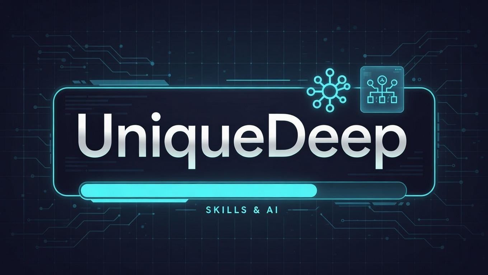

# UniqueDeep

<div align="center">



**使用 LangChain 构建的 Skills Agent**  
*实现类似 Anthropic Skills 三层加载机制的底层原理*

[](https://www.python.org/downloads/)
[](https://python.langchain.com/)
[](LICENSE)

[特性](#-特性) • [快速开始](#-快速开始) • [CLI命令](#-cli-命令)

</div>

---

## ✨ 特性

- 🧠 **Extended Thinking**: 原生支持显示模型的思考过程
- 🌊 **流式输出**: Token 级实时响应，打字机效果。
- 🛠️ **工具调用可视化**: 清晰展示工具名称、参数、执行状态（✅ 成功 / ⚠️ 执行中 / ❌ 失败）。
- 📚 **三层 Skills 加载**: 
  - **Level 1**: 元数据注入（极低 Token 消耗）
  - **Level 2**: 指令按需加载（Lazy Loading）
  - **Level 3**: 脚本沙箱执行（代码不进上下文）

## 🚀 快速开始

### 1. 安装

```bash
# 克隆项目
git clone https://github.com/wuzhaoqi1015/UniqueDeep.git

# 进入项目工作目录
cd UniqueDeep

# 安装依赖环境 (推荐使用 uv)
uv sync

```

<details>
<summary>（可选）安装初始skill：find-skills和skill-creator</summary>

#### find-skills：自动下载所需的skill

#### skill-creator：创建自定义skill

```bash
# 检查npm版本
npm -v

# (若版本低于18, 否则跳过)
npm install -g n
n lts
hash -r
node -v
npm -v

# 安装find-skills
npx skills add https://github.com/vercel-labs/skills --skill find-skills -y

# 安装skill-creator
npx skills add https://github.com/anthropics/skills --skill skill-creator -y


# 若显示超时，则配置ssh令牌，并添加进入
# ssh-add ~/.ssh/id_ed25519
# ssh-add -l
```
</details>


### 2. 配置模型

UniqueDeep 使用 [`models.json`](./models.json) 作为模型配置的唯一真实来源。该文件定义了可用的模型提供商、API 端点以及模型特定参数。

#### 第一步：复制模板文件

```bash
# 复制模型配置模板
cp models_template.json models.json

# 复制环境变量模板
cp .env.example .env
```

#### 第二步：配置环境变量

编辑 `.env` 文件，填入您的 API 密钥和端点：

```bash
# Anthropic
ANTHROPIC_API_KEY=sk-ant-xxx
ANTHROPIC_BASE_URL=https://api.anthropic.com

# DeepSeek (兼容 OpenAI 协议)
DEEPSEEK_API_KEY=sk-xxx
DEEPSEEK_BASE_URL=https://api.deepseek.com/v1

# OpenAI
OPENAI_API_KEY=sk-xxx
OPENAI_BASE_URL=https://api.openai.com/v1

# 其他提供商（如需使用）
GLM_API_KEY=xxx
KIMI_API_KEY=xxx
DOUBAO_SEED_API_KEY=xxx
GOOGLE_GENAI_API_KEY=xxx
# ... 更多变量请参考 .env.example
```

#### 第三步：验证配置

`models.json` 中已经使用环境变量占位符（如 `${ANTHROPIC_API_KEY}`）引用上述密钥。启动时系统会自动加载配置。

#### 动态切换模型

在交互式会话中，您可以使用 `/model <模型名称>` 命令动态切换模型，系统会自动更新 `models.json` 中的 `active_model` 字段。

支持的模型名称示例：`deepseek-reasoner`, `claude-opus-4-6`, `gpt-4o`, `glm-4` 等。

### 3. 交互式体验

启动交互式命令行界面：

```bash
uv run uniquedeep --interactive
```


### 4. Docker 支持

如果您希望在隔离的 Docker 沙盒环境中运行交互模式：

1. **构建并启动容器**：

```bash
docker compose run --rm uniquedeep
```

2. **环境变量**：
   Docker 会自动读取项目根目录下的 `.env` 文件，请确保已正确配置 API Key。

## 🏗️ Skills 三层加载机制

本项目核心在于复刻了高效的 Skills 加载架构：

| 层级 | 时机 | Token 消耗 | 内容 | 作用 |
|------|------|------------|------|------|
| **Level 1** | 启动时 | ~100/Skill | YAML frontmatter (name, description) | 让模型知道有哪些能力可用 |
| **Level 2** | 触发时 | <5000 | SKILL.md 完整指令 | 提供详细的操作 SOP |
| **Level 3** | 执行时 | **0** (仅输出) | 脚本执行结果 | 处理复杂逻辑，结果返回给模型 |

### 演示流程

1. **Level 1**: 启动时扫描 `.agents/skills`，注入元数据。
   ```text
   ✓ Discovered 4 skills
     - gro-seq-pipeline
     - xlsx
   ```

2. **Level 2**: 用户请求 "整理 GRO-Seq 数据"，模型命中 `gro-seq-pipeline` 描述，调用 `load_skill`。
   ```text
   ● Skill(gro-seq-pipeline)
     └ Successfully loaded skill
   ```

3. **Level 3**: 模型根据指令，调用 `bash` 运行脚本。
   ```text
   ● Bash(python create_gro_seq_sop.py)
     └ [OK] GRO-Seq分析流程SOP已保存到: GRO_Seq_Analysis_SOP.xlsx
   ```

## 💻 CLI 命令

| 命令 | 说明 |
|------|------|
| `uv run uniquedeep --interactive` | 启动交互式会话（推荐） |
| `uv run uniquedeep "列出文件"` | 单次执行任务 |
| `uv run uniquedeep --list-skills` | 查看已发现的 Skills |
| `docker compose run --rm uniquedeep` | 在 Docker 中启动交互模式 |
| `uv run uniquedeep --show-prompt` | 查看注入的 System Prompt |

**交互模式指令**:
- `/skills`: 列出所有技能
- `/prompt`: 显示当前 System Prompt
- `/temp [val]`: 动态调节温度 (0.0-1.0)
- `/model <名称>`: 动态切换模型（更新 `models.json`）
- `/exit`: 退出

## 📂 项目结构

```text
UniqueDeep/
├── src/uniquedeep/
│   ├── agent.py          # LangChain Agent (Extended Thinking)
│   ├── cli.py            # CLI 入口 (流式输出)
│   ├── tools.py          # 工具定义 (load_skill, bash, write_file, glob...)
│   ├── skill_loader.py   # Skills 发现和加载
│   └── stream/           # 流式处理模块
│       ├── emitter.py    # 事件发射器
│       ├── tracker.py    # 工具调用追踪（支持增量 JSON）
│       ├── formatter.py  # 结果格式化器
│       └── utils.py      # 常量和工具函数
├── tests/                # 单元测试
│   ├── test_stream.py
│   ├── test_cli.py
│   └── test_tools.py
├── docs/                 # 文档
│   ├── skill_introduce.md
│   └── langchain_agent_skill.md
└── .agent/skills/       # 示例 Skills
    └── gro-seq-pipeline/
        └── SKILL.md
    └── xlsx/
        ├── SKILL.md
        └── scripts/
```

## ⚙️ 环境变量

以下环境变量用于配置 API 密钥和端点（在 `.env` 文件中设置）：

| 变量 | 说明 | 示例 |
|------|------|--------|
| `ANTHROPIC_API_KEY` | Anthropic API 密钥 | `sk-ant-xxx` |
| `ANTHROPIC_BASE_URL` | Anthropic API 端点 | `https://api.anthropic.com` |
| `DEEPSEEK_API_KEY` | DeepSeek API 密钥 | `sk-xxx` |
| `DEEPSEEK_BASE_URL` | DeepSeek API 端点 | `https://api.deepseek.com/v1` |
| `OPENAI_API_KEY` | OpenAI API 密钥 | `sk-xxx` |
| `OPENAI_BASE_URL` | OpenAI API 端点 | `https://api.openai.com/v1` |
| `GLM_API_KEY` | 智谱AI API 密钥 | `xxx` |
| `GLM_BASE_URL` | 智谱AI API 端点 | `https://open.bigmodel.cn/api/paas/v4/` |
| `KIMI_API_KEY` | Kimi (Moonshot) API 密钥 | `xxx` |
| `KIMI_BASE_URL` | Kimi API 端点 | `https://api.moonshot.cn/v1` |
| `DOUBAO_SEED_API_KEY` | 豆包Seed API 密钥 | `xxx` |
| `DOUBAO_SEED_BASE_URL` | 豆包Seed API 端点 | `https://ark.cn-beijing.volces.com/api/v3` |
| `GOOGLE_GENAI_API_KEY` | Google Gemini API 密钥 | `xxx` |
| `GOOGLE_GENAI_BASE_URL` | Google Gemini API 端点 | `https://generativelanguage.googleapis.com/v1beta/openai` |

> **注意**：模型配置（如 `temperature`, `max_tokens`, `thinking` 模式等）现在统一通过 [`models.json`](./models.json) 管理。您可以通过交互式命令 `/model <模型名称>` 动态切换模型。

## 📚 参考文档

- [Skills 详细介绍](./docs/skill_introduce.md)
- [LangChain 实现原理](./docs/langchain_agent_skill.md)

## 📄 License

MIT © [UniqueDeep](https://github.com/wuzhaoqi1015/UniqueDeep)
