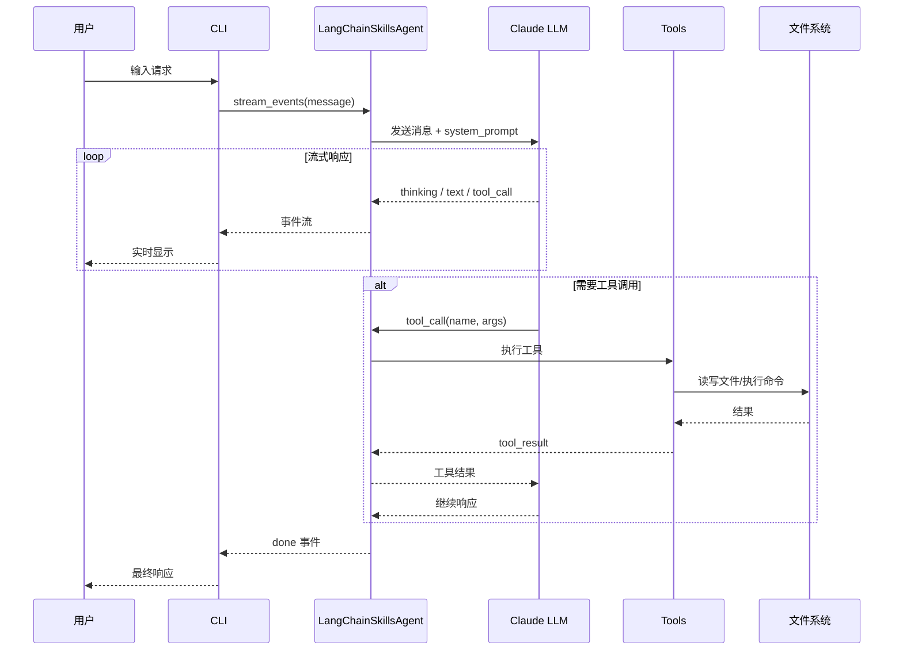
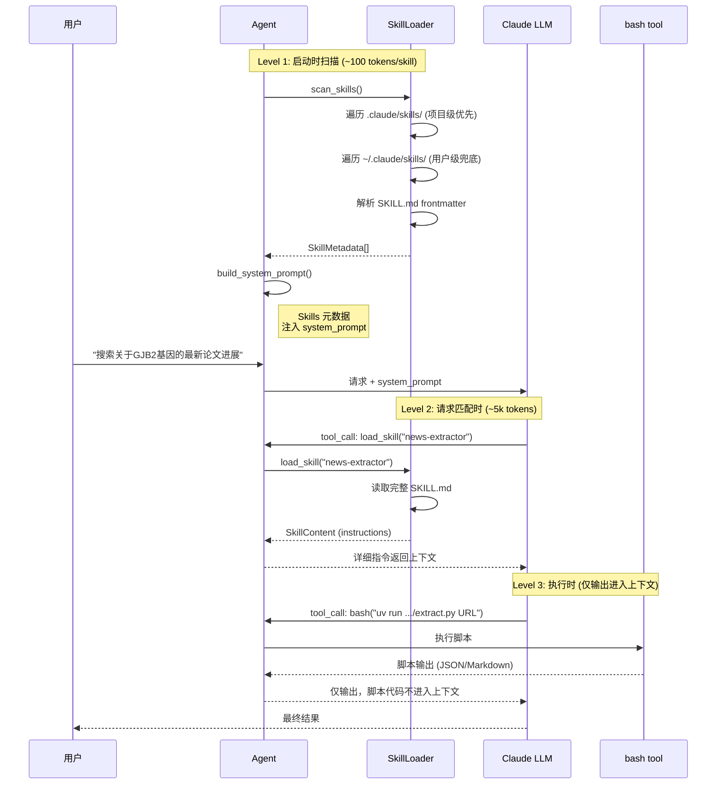
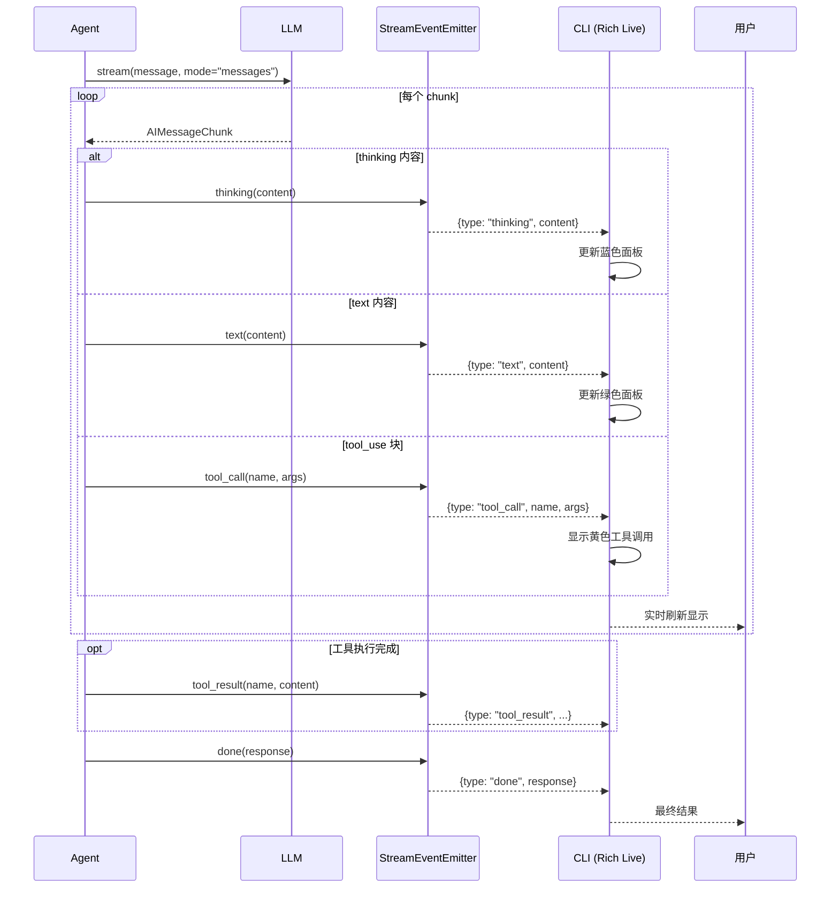
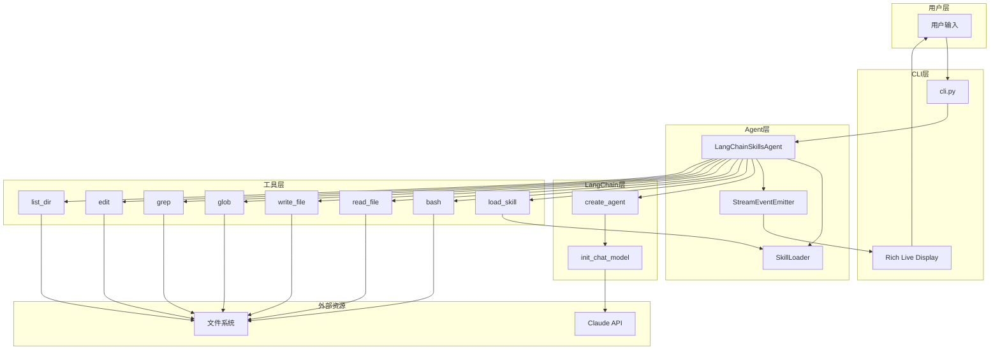
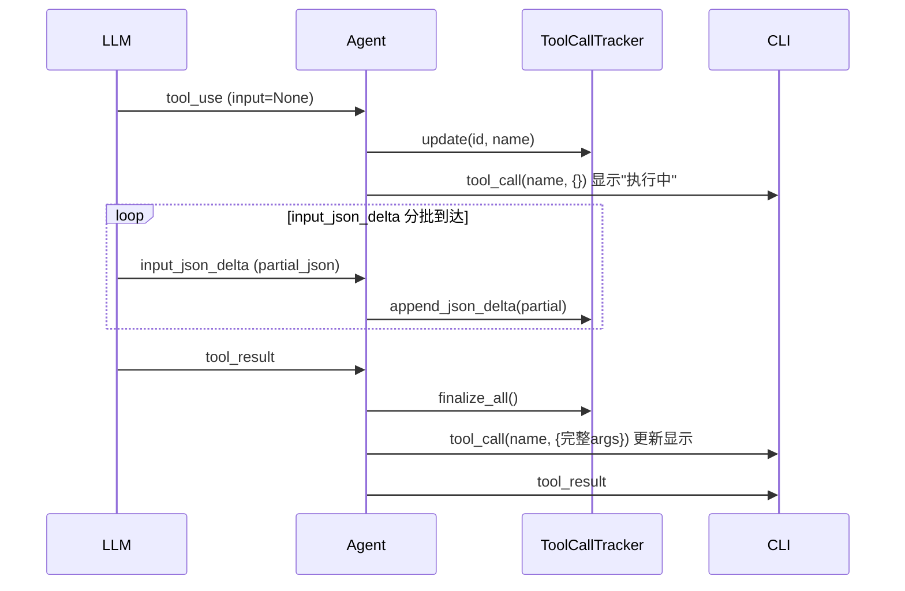

# LangChain Skills Agent 架构时序图

本文档通过 Mermaid 时序图展示 LangChain Skills Agent 的核心架构设计。

## 1. 整体交互流程

展示用户从输入到获得响应的完整链路：

## 2. 三层 Skill 加载机制

Skills 的核心设计：渐进式加载，减少 token 消耗。

### 设计要点

| 层级 | 触发时机 | 加载内容 | Token 消耗 |
|------|----------|----------|------------|
| Level 1 | Agent 启动 | Skills 元数据 (name + description) | ~100 tokens/skill |
| Level 2 | 请求匹配 | 完整 SKILL.md 指令 | ~5k tokens |
| Level 3 | 执行脚本 | 仅脚本输出 | 按输出大小 |

### Skills 搜索路径

Skills 从两个位置加载，**项目级优先**：

| 优先级 | 路径 | 说明 |
|--------|------|------|
| 1 (高) | `.claude/skills/` | 项目级 Skills，针对当前项目定制 |
| 2 (低) | `~/.claude/skills/` | 用户级 Skills，跨项目通用 |

当同名 Skill 同时存在于两个目录时，项目级版本会覆盖用户级版本。

## 3. 流式输出处理流程

Token 级别的实时响应机制：

### 事件类型

| 事件类型 | 描述 | CLI 显示 |
|----------|------|----------|
| `thinking` | 模型思考过程 | 蓝色面板 |
| `text` | 响应文本片段 | 绿色面板 |
| `tool_call` | 工具调用请求 | 黄色状态 + spinner |
| `tool_result` | 工具执行结果 | 格式化输出 |
| `done` | 流结束标记 | 完成状态 |
| `error` | 错误信息 | 红色提示 |

## 4. 组件职责

| 文件 | 职责 |
|------|------|
| `cli.py` | CLI 入口，Rich 流式显示，用户交互 |
| `agent.py` | LangChainSkillsAgent 核心，LangChain 集成 |
| `skill_loader.py` | Skills 扫描和加载，三层机制实现 |
| `tools.py` | 工具定义：load_skill, bash, read_file, write_file, glob, grep, edit, list_dir |
| `stream/emitter.py` | 流式事件格式化 |
| `stream/tracker.py` | 工具调用状态追踪 |
| `stream/formatter.py` | 工具结果格式化显示 |

## 5. 数据流向图

## 关键设计理念

1. **懒加载**: Skills 按需加载，减少 token 消耗
2. **透明执行**: 脚本代码不进入上下文，只有输出进入
3. **流式优先**: 所有响应都支持 token 级流式输出
4. **大模型自主**: 让 LLM 自己阅读指令、发现脚本、决定执行
5. **项目优先**: 项目级 Skills 覆盖用户级，支持针对性定制

## 6. 工具调用参数处理

LangChain 流式传输中，工具参数可能分批到达：

**关键设计**：
- `ToolCallTracker` 累积 JSON 片段，使用 `args_complete` 标志标记参数是否完整
- CLI 使用 `tool_id` 去重和更新显示
- 先显示"执行中"状态，参数完整后更新为完整参数
